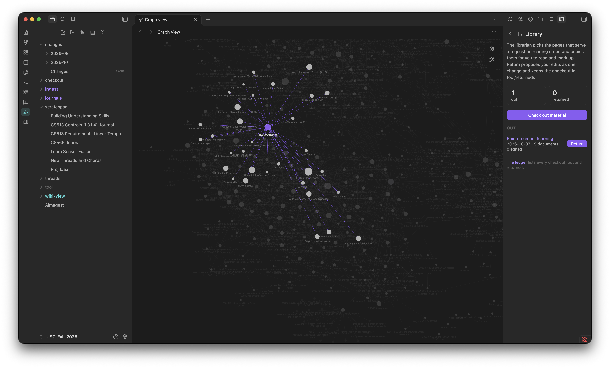
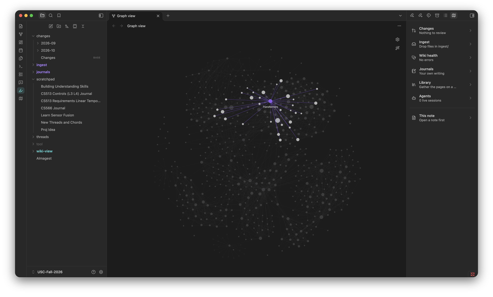
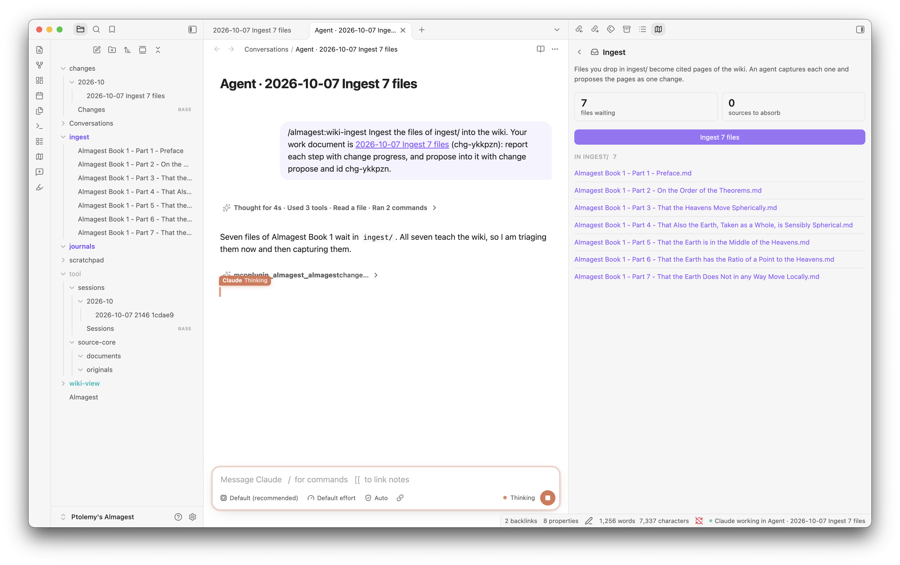
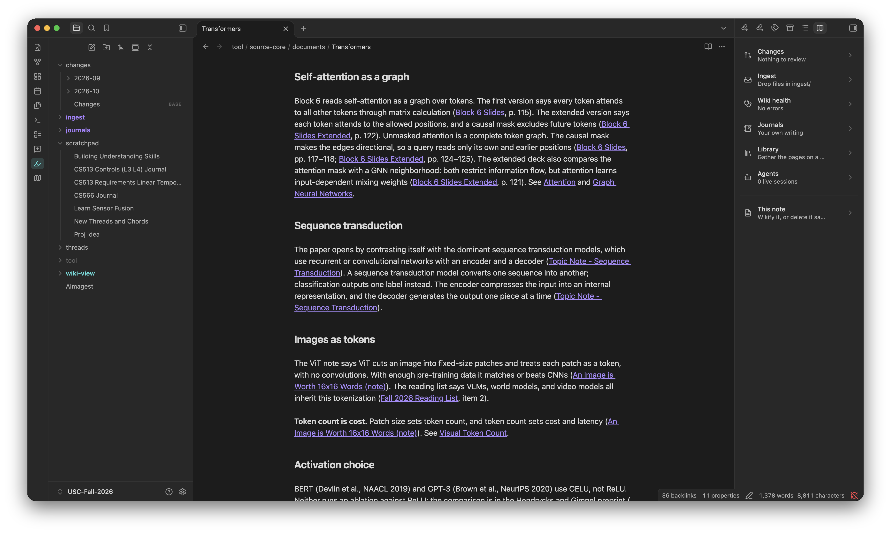
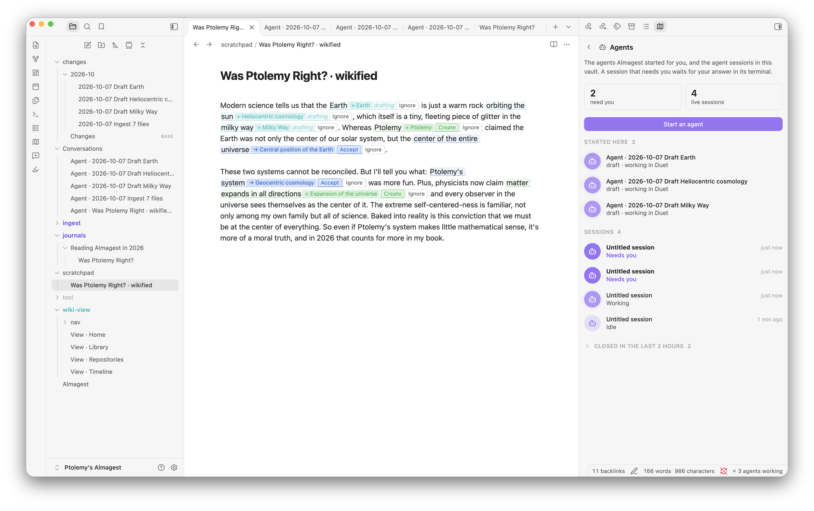
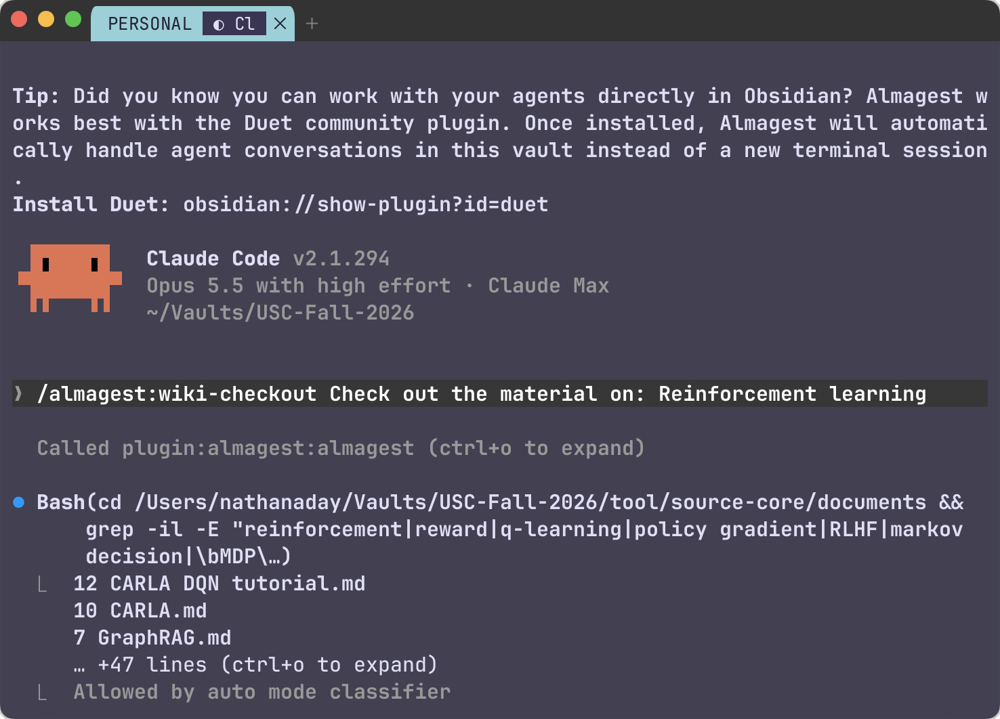

# Almagest

*(al-ma-jest)*


> *Ptolemy presented the most complete geocentric model of the universe in his 2nd-century work **Almagest***
> *Art by Bartolomeu Velho, 1568. Public domain. [Source](https://commons.wikimedia.org/w/index.php?curid=3672259)*

---

# Build a wiki for humans, not just LLMs

There are so many LLM wiki tools circulating the open source world, and basically all of them are good. As promised, they ingest information accurately, your knowledge base grows, and your agents are connecting dots while they work on projects of immense scale. 

But there were drawbacks in my experiences with AI second brains since day one. Primarily, that I want to use my knowledge base too. I don't want to only bury information for my agents to retrieve later on out of thin air. My wiki would grow unbounded and I would never read from it, simply because it was overwhelming to navigate such a scale of information that these tools let us create.

### Almagest Guiding Principles

1. Get your thoughts down in your own words with no friction, and never lose them
2. Ingest your documents, repos, and sources with no friction, and never lose them
3. Agents query the knowledge base automatically and efficiently
4. You query the knowledge baes effortlessly and with joy

<p align="center">
  
  
</p>

# Features

### Claude / Codex MCP Plugin

All the tools you need to onboard, ingest, search, lint, checkout, and more, using natural language with your agents. 

Paired with the [Duet] plugin, which lets you start agent conversations within Obsidian, you never have to leave the vault to get your work done.

### Wiki Ingest

Drop papers, PDFs, or notes into `ingest/`, and press Ingest. Each ingest task becomes one
document that you watch as it works. Change logs can be approved, canceled, edited, and questioned.

<p align="center">
  
</p>


### Approve / Reject Flow for all Agent Changes

Any change to your knowledge base gets a dedicated "changes" page with a clear approve or deny path. You can also edit the change plan, or ask your agents for clarifications. This keeps your knowledge base under your control.

<p align="center">
  
</p>


### Wiki View for humans, Wiki Core for agents

All raw sources, change logs, and llm doc live under the hood in a `tool/` directory. It's self-updating, but you don't have to look at it. This is where the MCP tools do fast information queries and where all new sources are ingested.

The plugin constructs your `wiki-view` from these sources: a home age, timeline, library, and a navigation page for each tag. The user-interface can evolve over time with improvements with no impact to the core structure.

<p align="center">
  
  
</p>


### Repository Links

Link your code repositories, and the agent writes a page for each. An agent started in
the vault finds the repository you mean and works in it, and its session leaves a
record of what it did.

### Journals

A `journals/` area holds your own writing, organized by volumes. You are the contributor! Crucially, your journal does not move when its ingested. It stays there in `journals/`, even though its been integrated into your knowledge base.

When you want the wiki to learn from a volume, use the Publish action. Almagest captures the whole journal as one edition, then the agent ingests it as it would any source. Every edition stays in the vault, and each volume keeps a publication history. 

### Librarian

Ask to "check out all the material on reinforcement learning" or whatever topic you have in your vault. The librarian finds all relevant pages, follows their links only as far as they stay relevant, and puts copies of them in `checkout/` with a reading list. Read and mark up the copies. The (optional) `Return` action proposes your edits to the originals as one change, and a ledger lists every checkout.

<p align="center">
  
  
</p>

### Wikify a note (experimental)

Take any draft you are working on. The agent marks what the wiki already knows, then marks the subjects that are new and worth a page. You can Accept or Ignore new links directly on the UI. The wikified note stays where you are working on it, and does not need to enter the knowledge base until you are ready to ingest it.

<p align="center">
  
</p>

### Safe delete

Not sure whether you can delete a page? Don't want to break anything? Safe delete moves it to `tool/trash/` when nothing links it. When something does, it shows the links, and an agent can repoint them for you. Empty `tool/trash/` yourself when you like.

### Agent Conversations

Supports agent sessions in a terminal of your choice or directly in Obsidian using the Duet plugin.

<p align="center">
  
</p>


## Quickstart

>[!warning]
>Unfortunately Windows support has not been added for the plugin. It's coming soon.

You need macOS or Linux with `git` and `curl`, Claude Code (or Codex), and Obsidian.

1. **Install the agent plugin** in Claude Code, then restart Claude Code:

   ```bash
   claude plugin marketplace add nathanaday/almagest
   claude plugin install almagest@nathanaday-almagest
   ```

   Its first session installs the `almagest` program for your system, checked against
   the checksum the plugin carries. You build nothing. For Codex, see the
   [guide](docs/guide.md#codex).

2. **Make a vault.** Start Claude Code in an empty folder and say **"set up almagest"**.
   The agent asks a few questions, makes the vault, and offers to link your code
   repositories.

3. **Open it in Obsidian** (Open folder as vault), and install **Almagest** from the
   community plugins (`obsidian://show-plugin?id=almagest`) for the palette and the
   Approve buttons.

4. **Ingest something.** Put a paper or a few notes in `ingest/`, then press Ingest in
   the palette, or say **"ingest my files"** to your agent in the vault.

5. **Approve.** Read the ingest document in `changes/`, then press Approve. Open
   `wiki-view/` to read your wiki.

`almagest doctor` checks the whole install when something does not work.

## Coming next

- **Socratic learning:** an agent that quizzes you on a checkout, to learn it.
- **Mastery:** a score for each page, and the focus areas you are working to master.
- **Guided journaling:** an agent that helps you reflect on your project and priorities.

## Learn more

- [The user guide](docs/guide.md): what to ask, install and update, the files in a vault,
  each feature in depth, and the settings.
- [SECURITY.md](SECURITY.md): what agents may and may not do, and how the program is
  installed and verified.
- [CLAUDE.md](CLAUDE.md): notes for anyone who works on this code.
- [obsidian-almagest](https://github.com/nathanaday/obsidian-almagest): the Obsidian
  plugin.

## License

MIT. See [LICENSE](LICENSE).
